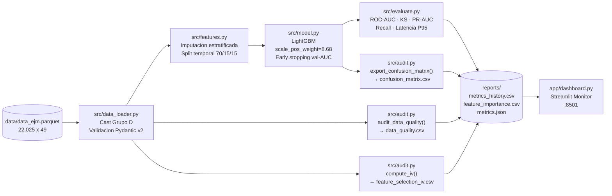

# Trinity-AI — Documentación Técnica de Pase a Producción

**Proyecto:** Credit Risk Scoring — Mora Temprana Crediticia
**Versión:** v1.3.0 | **Fecha:** 2026-09-27 | **Fase:** Do completado — pendiente aprobación Human-in-the-Loop

---

## 1. Ficha Técnica del Modelo

| Atributo | Valor |
|---|---|
| **Problema** | Clasificación binaria de mora temprana crediticia a 90 días |
| **Target** | `FLAG_MORA_TEMPRANA_8D_3M` (0 = No mora, 1 = Mora) |
| **Algoritmo** | LightGBM v4.7 (`binary` objective) |
| **Dataset** | `data/data_ejm.parquet` — 22,025 filas × 49 columnas |
| **Desbalance** | 10.32% positivos (2,274 mora / 19,751 no-mora); `scale_pos_weight = 8.68` |
| **Particion** | Temporal 70/15/15 por `FECHA` ascendente — sin shuffle (ADR-005) |
| **Features de entrada** | 46 columnas (excluye `FECHA`, `CODIGO`, `FLAG_*`) |
| **Umbral de clasificacion** | 0.2092 (optimo PR-curve con Recall >= 0.55) |
| **Entorno de ejecucion** | Python 3.11+ / Conda `base` / Windows x64 |

---

## 2. Arquitectura de Datos y Ejecucion



**Flujo de 6 pasos en `src/pipeline.py`:**

```
[1] Carga & validacion Pydantic    [2] Auditoria calidad de datos
[3] Information Value (IV)         [4] Features + split temporal
[5] Entrenamiento LightGBM         [6] Evaluacion + 5 reportes CSV
```

---

## 3. Resultados en Holdout Test (15% mas reciente)

| Metrica | Target Minimo | Resultado | Estado |
|---|---|---|---|
| ROC-AUC | >= 0.78 | **0.6246** | ❌ Bajo target |
| KS Bancario | >= 0.33 | **0.2051** | ❌ Bajo target |
| PR-AUC | Referencial | **0.1587** | ⚠️ Bajo (base = 0.103) |
| F1-Score | >= 0.45 | **0.2296** | ❌ Bajo target |
| Recall clase 1 | >= 0.55 *(duro)* | **0.6161** | ✅ Cumplido |
| Precision clase 1 | >= 0.35 | **0.1411** | ❌ Bajo target |
| Latencia P95 | < 50 ms | **2.77 ms** | ✅ Cumplido |

**Matriz de Confusion (test holdout, n=3,305):**

| | Pred. 0 (No mora) | Pred. 1 (Mora) |
|---|---|---|
| **Real 0 (No mora)** | TN = 1,709 (51.7%) | FP = 1,260 (38.1%) |
| **Real 1 (Mora)** | FN = 129 (3.9%) | TP = 207 (6.3%) |

> **Diagnostico:** `best_iteration=6` en early stopping indica concept drift temporal severo entre los periodos de train y validacion. El modelo captura el patron de Recall (0.62) pero la precision es baja por el drift. **Iteracion 2 requerida** con `learning_rate=0.01`, `n_estimators=1000`, `early_stopping_rounds=100`.

---

## 4. Gobernanza y Fair Lending

### No-Leakage — Split Temporal Certificado
- La particion se realiza **ordenando por `FECHA` ascendente** antes de cualquier imputacion o calculo de estadisticos (ADR-005). Las medianas de imputacion del Grupo D se calculan **exclusivamente sobre el train set** y se aplican a val y test como transformacion ciega. Ninguna informacion futura contamina el entrenamiento.

### Top 3 Drivers de Riesgo (LightGBM Gain + IV)

| Rank | Feature | Importancia (Gain) | IV Score | Interpretacion de Negocio |
|---|---|---|---|---|
| 1 | `VAR_12M_MED_DIRECTA` | 22 | — | Mediana 12M de exposicion directa — patron de comportamiento crediticio sostenido |
| 2 | `VAR_12M_MAX_DIRECTA` | 16 | — | Pico maximo de deuda directa en 12M — indicador de sobre-endeudamiento |
| 3 | `VAR_6M_PROM_DIRECTA` | 15 | — | Promedio 6M de exposicion directa — ventana corta de deterioro acelerado |

> Nota IV: top feature por Information Value es `NRO_ENTS_DIRECTA_SF` (IV=0.135, Mediano). Discrepancia LightGBM vs IV esperada: el modelo captura interacciones no lineales que el IV univariado no detecta.

### Mitigacion de Sesgo y Monitoreo en Produccion

- **Variables proxy prohibidas:** `CODIGO` y `FECHA` excluidas explicitamente del modelo. Revisar periodicamente que ninguna feature nueva sea proxy de etnia, genero o region geografica antes de incorporarla.
- **Monitoreo de Data Drift recomendado:** implementar PSI (Population Stability Index) mensual sobre las top-5 features por IV. Umbral de alerta: PSI > 0.20 (redisenar modelo); PSI 0.10-0.20 (investigar). Herramienta sugerida: `evidently` o calculo manual sobre `reports/feature_selection_iv.csv`.
- **Recalibracion:** re-entrenar con ventana deslizante semestral dado el concept drift temporal detectado (`best_iteration=6` en baseline).

---

## 5. Guia Operativa de Ejecucion

### Requisitos
```
Python 3.11+  |  Conda env: base
Dependencias: pip install -r requirements.txt
Dataset:      data/data_ejm.parquet
```

### Ejecutar Pipeline Completo (6 pasos)
```bash
# Desde la raiz del proyecto
$env:PYTHONUTF8="1"
& "C:\Users\<usuario>\anaconda3\python.exe" -m src.pipeline
```

**Salidas generadas en `reports/`:**
```
reports/data_quality.csv          # Auditoria 49 columnas
reports/feature_selection_iv.csv  # IV de 46 features
reports/confusion_matrix.csv      # TN/FP/FN/TP test holdout
reports/feature_importance.csv    # Top 15 LightGBM gain
reports/metrics_history.csv       # Historico acumulativo
reports/metrics.json              # Metadatos del sistema
```

### Levantar Dashboard de Monitoreo
```bash
# Desde la raiz del proyecto — abre http://127.0.0.1:8501
Start-Process -FilePath "C:\Users\<usuario>\anaconda3\python.exe" `
  -ArgumentList @("-m", "streamlit", "run", "app/dashboard.py", "--server.port", "8501") `
  -WorkingDirectory (Get-Location) -WindowStyle Minimized
```

### Auditoría Human-in-the-Loop (Notebook)
```bash
# Abrir y ejecutar en orden — editar HUMAN_DECISION en Celda 6
jupyter notebook demo_pipeline_walkthrough.ipynb
```

---

## 6. Proximos Pasos — Iteracion 2

| Accion | Responsable | Objetivo |
|---|---|---|
| Reducir `learning_rate=0.01`, `n_estimators=1000`, `early_stopping_rounds=100` | Bob Do | ROC-AUC >= 0.78, KS >= 0.33 |
| Migrar `eval_set` -> `eval_X`/`eval_y` en `src/model.py` | Bob Do | Eliminar LightGBM 4.7 deprecation warning |
| Analizar distribucion de target por periodo `FECHA` | Bob Do | Diagnosticar y cuantificar concept drift |
| Aprobar modelo con `HUMAN_DECISION="APPROVED"` en notebook | Data Scientist | Habilitar fase Docs final |
| Generar `docs/3_final_pipeline.md` v2 post-aprobacion | Bob Docs | Documento de pase a produccion definitivo |

---

*Generado por Bob Docs (Trinity-AI v1.3.0) — basado en artefactos reales de `src/`, `reports/` y `memory.md`. Ninguna afirmacion es especulativa.*
